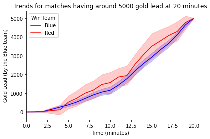

# LoL Match Result Prediction

League of Legends (LoL) is one of the most widely played video games in the world. The game consits of two teams of five players, each occupying and defending their own half of the map. The primary objective is to destroy the opposing team's Nexus, which is located in each team's base.

There are many factors influencing the match result, which includes pre-game knowledge (such as individual player's skill and players choice of game characters) and in-game player statistics. In this project, we focus solely on the gold (in-game currency) gained by each team. It is not surprising that the team with a gold lead has a strong advantage, but it doesn't always result in a win.

The ultimate goal of this project is to
1. determine whether there exists a hidden pattern for teams that were in lead but lose the match in the end;
2. make a real-time win rate prediction based on gold gained by each team.

## Data Collection

Our data was acquired from the [Riot Games API](https://developer.riotgames.com/). We collected over 70,000 matches played by challenger players (highest rank in the game) in the current season (season 11).

*This project isn't endorsed by Riot Games and doesn't reflect the views or opinions of Riot Games or anyone officially involved in producing or managing Riot Games properties. Riot Games, and all associated properties are trademarks or registered trademarks of Riot Games, Inc.*

*TODO: Add some (many?) graphs here*

## Methods

Our features are the gold gained by each team in the first 20 minutes of the match, which can be treated as a (multivariate) time series classification problem. We implemented various models and evaluated their performance.

**General Classification Models**
* Decision Tree
* Random Forest
* k-Nearest Neighbour
* Logistic Regression

**Time Series Classification**
* Time Series Forest
* Bag-of-SFA Symbols (BOSS)
* Shapelet Transform

**Neural Network**
* Fully-connected Feed-forward Neural Network
* Convolutional Neural Network
* Recurrent Neural Network
